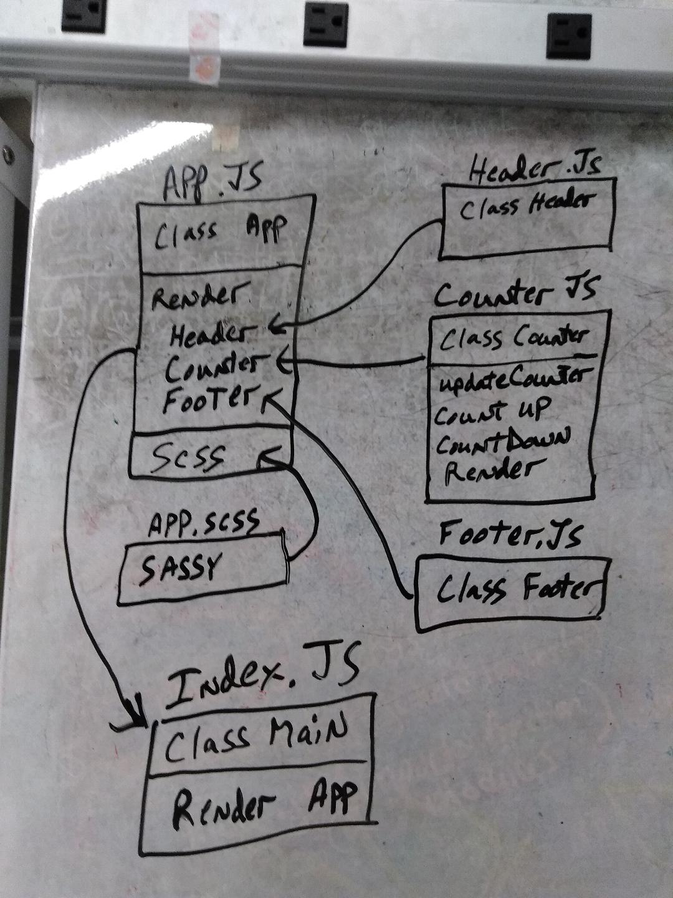

 LAB
=================================================

## Lab 26

### Author: Ed Puzino

### Links and Resources
* [repl.it](https://repl.it/@edpuzino/Destructuring-and-Spread) This took about an hour once I watched class videos and read up on this and finally understood what I was supposed to do, which took about eight hours.
* [repo](https://github.com/edpuzino/lab-26)
* [sandbox](https://codesandbox.io/s/2or7n1vq6r)

### Files

#### `App.js`
##### `Class App`

#### `Header.js`
##### `Class Header`

#### `Footer.js`
##### `Class Footer`

#### `Counter.js`
##### `Class Counter`
###### `updateCounter`
###### `countUp`
###### `countDown`

#### `Index.js`
##### `Class Main`

#### `App.scss`

###### `bar(array) -> array`
Usage Notes or examples

### Setup
#### `.env` requirements
* `PORT` - 3000
* `MONGODB_URI` - mongodb://localhost:27017/store

#### Running the app
* click on the link to codesandbox above

#### UML

